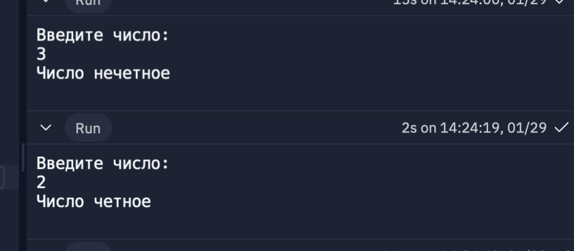
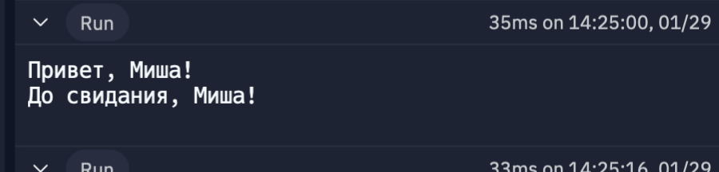
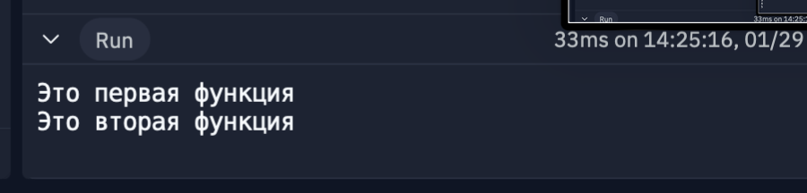
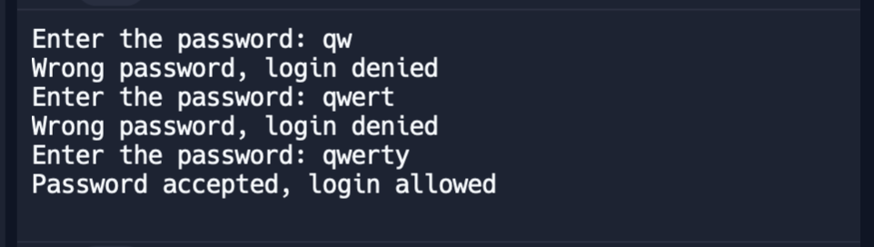

# OSbash
Первая(Провервка на четность, используя if)

Вторая(Вывод чисел от 1 до 5, используя while)

Третья(Вызов функций)

Четвертая(Вызов функции из другой функции)

Пятая(Проверка пароля, покв он не подойдет, используя while)

